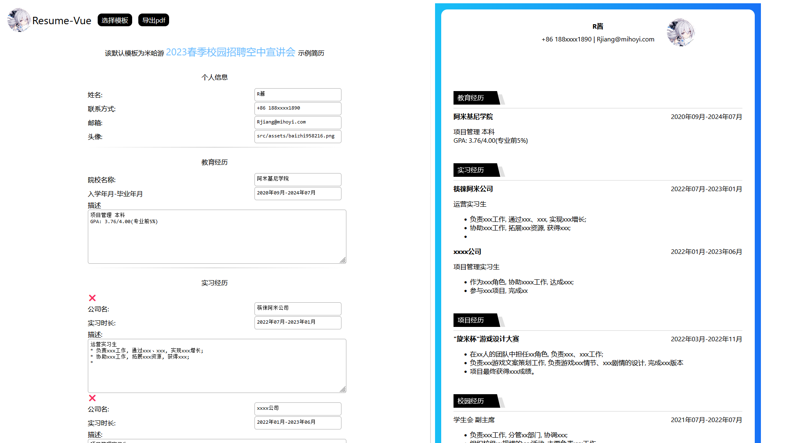

# resume-vue



## 生成可视化简历

todo:

- [ ] 导出 pdf
- [ ] 预览模板缩放
- [ ] 模板分页

### 模板目录

`src/components/Info`: 信息填写模板  
`src/components/Review`: 简历预览模板  
`src/stores`: 数据模板

- 项目搭建

```sh
pnpm i
```

- 启动

```sh
pnpm dev
```
